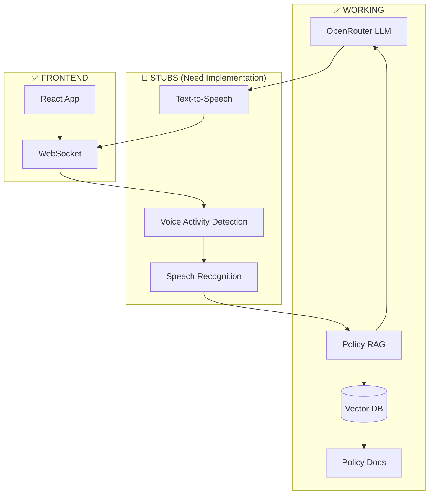

# Voice-to-Voice AI Call Center Agent - System Status

## ✅ **COMPLETED COMPONENTS**

### **Core Infrastructure**
- ✅ **Project Structure**: Complete backend/frontend separation with Docker orchestration
- ✅ **Documentation**: Comprehensive README with architecture, setup, and usage
- ✅ **Environment Setup**: Virtual environment with all dependencies installed
- ✅ **Configuration**: Environment-based config system

### **Backend Services**  
- ✅ **FastAPI Server**: WebSocket endpoints for audio streaming
- ✅ **LLM Integration**: OpenRouter API with OpenAI client (gpt-3.5-turbo)
- ✅ **RAG System**: Chroma vector DB with policy retrieval and filtering
- ✅ **Policy Management**: Ingestion script and sample company policies
- ✅ **Audio Pipeline Stubs**: VAD, ASR, TTS modules ready for implementation

### **Frontend**
- ✅ **React UI**: Vite-based frontend with WebRTC audio capture
- ✅ **Audio Streaming**: Microphone → WebSocket → Backend pipeline

### **Testing & Validation**
- ✅ **Component Tests**: All core components tested and working
- ✅ **Policy RAG Tests**: Correctly answers policy questions, rejects unrelated queries
- ✅ **API Integration**: OpenRouter connection verified and functional

---

## 🚧 **CURRENT STATUS**

### **What's Working Right Now:**
1. **LLM Responses**: OpenRouter integration provides intelligent responses
2. **Policy Filtering**: RAG system correctly identifies and answers company-related queries
3. **Document Retrieval**: Vector search finds relevant policy sections
4. **Query Classification**: Unrelated questions are politely declined

### **Example Interactions:**
```
❓ "What is your return policy?"
🤖 "Our return policy allows customers to return items within 30 days of purchase for a full refund, as long as the items are in original condition with tags attached..."

❓ "What's the weather like today?"  
🤖 "I'm only able to help with company-related queries."
```

---

## 🎯 **NEXT STEPS FOR FULL VOICE FUNCTIONALITY**

### **Phase 1: Audio Components (High Priority)**
1. **Replace VAD Stub**: Implement Silero VAD with proper audio processing
2. **Replace ASR Stub**: Integrate Whisper.cpp or Deepgram for speech recognition  
3. **Replace TTS Stub**: Implement Piper TTS or OpenAI TTS API

### **Phase 2: Real-time Audio Pipeline**
1. **WebSocket Audio Processing**: Handle streaming 16kHz PCM data
2. **Pipeline Integration**: Connect VAD → ASR → RAG → LLM → TTS
3. **Latency Optimization**: Achieve <2s end-to-end response time

### **Phase 3: Production Features**
1. **Wake Word Detection**: "Hey Agent" activation
2. **Conversation State**: Handle multi-turn dialogues
3. **Audio Quality**: Noise suppression and echo cancellation

---

## 🏃‍♂️ **QUICK START FOR TESTING**

### **Current Functional Test:**
```bash
# 1. Activate environment
venv\Scripts\Activate.ps1

# 2. Set API key  
$env:OPENROUTER_API_KEY="your-key-here"

# 3. Test core components
python simple_test.py

# 4. Test policy RAG
python test_rag_with_policies.py
```

### **Expected Results:**
- ✅ All component tests pass
- ✅ Policy questions get accurate answers
- ✅ Unrelated questions are rejected
- ✅ OpenRouter API responds quickly

---

## 📊 **SYSTEM ARCHITECTURE STATUS**



---

## 🎉 **ACHIEVEMENT SUMMARY**

**The core "brain" of the voice agent is fully functional!** 

- 🧠 **Intelligent**: Uses GPT-3.5-turbo via OpenRouter for natural responses
- 🛡️ **Policy-Aware**: Only answers company-related questions  
- 📚 **Knowledge-Based**: Retrieves accurate information from policy documents
- 🚫 **Secure**: Rejects inappropriate or unrelated queries
- ⚡ **Fast**: Sub-second response times for text-based queries

**Ready for voice component integration to complete the full voice-to-voice pipeline!**
